<div align="center">

<!-- Kiran Kumar Behera · animated terminal profile -->
<picture>
  <source media="(prefers-color-scheme: dark)" srcset="assets/banner-dark.v13.svg">
  <source media="(prefers-color-scheme: light)" srcset="assets/banner-light.v13.svg">
  
</picture>

<br>

<a href="https://github.com/kiran-devhub">
  
</a>

<br>

<a href="https://kkbportfolio.vercel.app/"></a>&nbsp;&nbsp;
<a href="https://github.com/kiran-devhub"></a>&nbsp;&nbsp;
<a href="mailto:kiran.devhub@gmail.com"></a>

<br><br>


</div>

---

## This is me :)

Hi, I'm **Kiran Kumar Behera**, a **Developer / Cybersecurity** enthusiast focused on building secure, scalable web applications.

- 💻 Building full-stack applications with **React, Next.js, Node.js, Express, REST APIs, and databases**.
- 🔐 Developing practical security skills around **OWASP Top 10, secure authentication, protected routes, bcrypt, and web security fundamentals**.
- 🐧 Exploring **Kali Linux** and ethical-hacking fundamentals while keeping a defensive, security-first mindset.
- 🤖 Exploring **AI-assisted development workflows** with modern AI tools.
- 🌱 Continuously learning, building, testing, and improving.
- 🚀 Open to **Full Stack Developer Internships, Entry-Level Software Engineer Roles, Cybersecurity Internships, and Open Source Contributions**.

<br>

<div align="center">

> **Build. Secure. Share. Repeat.**

</div>

---

<div align="center">

## my perfect stack`


</div>

---

<div align="center">

## signals

<table>
<tr>
<td width="50%" align="center" valign="middle">

<picture>
  <source media="(prefers-color-scheme: dark)" srcset="assets/radar-dark.svg">
  <source media="(prefers-color-scheme: light)" srcset="assets/radar-light.svg">
  
</picture>

</td>
<td width="50%" align="center" valign="middle">

<picture>
  <source media="(prefers-color-scheme: dark)" srcset="assets/radar-langs-dark.svg">
  <source media="(prefers-color-scheme: light)" srcset="assets/radar-langs-light.svg">
  
</picture>

</td>
</tr>
</table>

</div>

---

<div align="center">

## Numbers matter? ohhh yes.

<picture>
  <source media="(prefers-color-scheme: dark)" srcset="assets/card-stats-dark.svg">
  <source media="(prefers-color-scheme: light)" srcset="assets/card-stats-light.svg">
  
</picture>

<br>


</div>

---

## `$ whoami`

```typescript
const kiran = {
  username: "kiran-devhub",
  name: "Kiran Kumar Behera",
  role: "Developer / Cybersecurity",
  focus: ["Secure Web Applications", "Cybersecurity"],
  languages: ["JavaScript", "TypeScript", "Python", "Java", "C/C++"],
  frontend: ["React", "Next.js", "HTML5", "CSS3", "Tailwind CSS"],
  backend: ["Node.js", "Express.js", "REST APIs", "JWT", "Clerk"],
  databases: ["MongoDB", "MySQL", "Supabase", "Firebase"],
  cloud: ["Vercel", "Netlify", "GitHub Pages"],
  security: ["OWASP Top 10", "Secure Auth", "bcrypt", "Protected Routes"],
  learning: ["Web Security", "Ethical Hacking Fundamentals", "Kali Linux"],
  status: "Building + Learning + Shipping",
} as const;
```

---

## `$ cat current_focus.yaml`

```yaml
learning:
  - "Node.js — REST APIs, middleware architecture, auth flows"
  - "React / Next.js — component architecture and performance"
  - "Web security — OWASP Top 10 and secure authentication patterns"
  - "Cybersecurity fundamentals — ethical hacking and Kali Linux"

building:
  - "Secure full-stack applications with MERN + Next.js"
  - "Authentication systems using JWT, bcrypt, and Clerk"
  - "Practical security-focused web projects"

exploring:
  - "AI-assisted development workflows"
  - "Open-source contribution"
  - "Better application security and defensive engineering"

open_to:
  - "Full Stack Developer Internships"
  - "Entry-Level Software Engineer Roles"
  - "Cybersecurity Internships"
  - "Open Source Contributions"
```

---

## `$ ls -la featured_repositories/`

Repository cards are generated by GitHub Actions. By default, the workflow can select recently pushed public repositories from `kiran-devhub`.

To control the order or choose specific projects, edit:

```text
assets/projects.json
```

---

## `$ tail -f activity.log`

<div align="center">

<a href="https://github.com/kiran-devhub?tab=repositories">
  
</a>

</div>

---

## `$ ./connect.sh --all`

<div align="center">

<a href="https://kkbportfolio.vercel.app/"></a>
<a href="https://github.com/kiran-devhub"></a>
<a href="mailto:kiran.devhub@gmail.com"></a>

<br><br>

<sub>` profile.sh --live · kiran-devhub · developer / cybersecurity `</sub>

</div>

---

<div align="center">

**Build secure. Learn continuously. Ship deliberately.**

</div>
