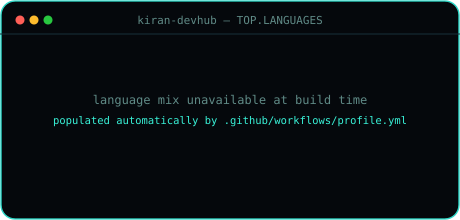

<div align="center">

<picture>
  <source media="(prefers-color-scheme: dark)" srcset="assets/banner-dark.svg">
  <source media="(prefers-color-scheme: light)" srcset="assets/banner-light.svg">
  
</picture>

</div>

<br>

```
kiran@devhub:~$ cat intro.log
[ok] booting profile...
[ok] identity confirmed :: Kiran Kumar Behera
[ok] role :: Developer / Cybersecurity
[ok] mission :: build secure, fast, and honest software
[ok] status :: online
kiran@devhub:~$ _
```

## This is me :)

I'm Kiran — a developer who spends most of his time somewhere between shipping web
applications and pulling them apart to see where they'd break. I like building things
that are fast and pleasant to use, and I like them even more once they're hardened
against the stuff that usually gets skipped: broken auth, sloppy input handling,
leaking headers, all the boring failure modes that cause the interesting incidents.

Currently focused on secure web applications — writing them, and learning how to
attack them so I write them better next time.

- 🌐 Portfolio: [kkbportfolio.vercel.app](https://kkbportfolio.vercel.app/)
- 📫 Email: [kiran.devhub@gmail.com](mailto:kiran.devhub@gmail.com)
- 🛡️ Focus: secure web applications, applied OWASP practice, clean API design

<br>

## My perfect stack

<div align="center">

| | |
|---|---|
| **Languages** |      |
| **Frontend** |      |
| **Backend** |     |
| **Databases** |     |
| **Cloud** |    |
| **Security** |    |
| **Tools** |      |

</div>

> Full list lives in [`assets/skills.json`](assets/skills.json) — edit it, then re-run
> `scripts/radar.py`, and both this table and the radar card below regenerate from the
> same source of truth.

<br>

## GitHub statistics

<div align="center">
<picture>
  <source media="(prefers-color-scheme: dark)" srcset="assets/card-stats-dark.svg">
  <source media="(prefers-color-scheme: light)" srcset="assets/card-stats-light.svg">
  
</picture>
<picture>
  <source media="(prefers-color-scheme: dark)" srcset="assets/radar-dark.svg">
  <source media="(prefers-color-scheme: light)" srcset="assets/radar-light.svg">
  
</picture>
</div>

<sub>Stats are pulled live from the GitHub REST API by `scripts/cards.py` and refreshed
daily by [`.github/workflows/profile.yml`](.github/workflows/profile.yml) — nothing here
is hand-typed. The radar is self-declared skill levels from `assets/skills.json`, kept
visually distinct from the live stats card on purpose.</sub>

<br>

## Top languages

<div align="center">
<picture>
  <source media="(prefers-color-scheme: dark)" srcset="assets/metrics.languages.svg">
  <source media="(prefers-color-scheme: light)" srcset="assets/metrics.languages.svg">
  
</picture>
<picture>
  <source media="(prefers-color-scheme: dark)" srcset="assets/radar-langs-dark.svg">
  <source media="(prefers-color-scheme: light)" srcset="assets/radar-langs-light.svg">
  
</picture>
</div>

<sub>Computed from real per-repository language byte counts (`scripts/languages.py`),
cached in [`assets/langmix.json`](assets/langmix.json).</sub>

<br>

## Contribution activity

<div align="center">
<picture>
  <source media="(prefers-color-scheme: dark)" srcset="https://github-readme-activity-graph.vercel.app/graph?username=kiran-devhub&theme=react-dark&hide_border=true&bg_color=05080c&color=38f2d8&line=38f2d8&point=ff3e7f">
  <source media="(prefers-color-scheme: light)" srcset="https://github-readme-activity-graph.vercel.app/graph?username=kiran-devhub&theme=default&hide_border=true&bg_color=ffffff&color=0f8b7d&line=0f8b7d&point=c81361">
  
</picture>
</div>

<sub>This graph is rendered live from your real public contribution calendar by the
community [`github-readme-activity-graph`](https://github.com/Ashutosh00710/github-readme-activity-graph)
service — it isn't one of this repo's own scripts because contribution data requires a
GraphQL scope beyond the plain REST calls `scripts/cards.py` and `scripts/languages.py`
use. See `SETUP.md` if you'd rather self-host it.</sub>

<br>

## Current focus

```
kiran@devhub:~$ cat current_focus.log
> Hardening authentication flows and session handling in personal projects
> Practicing the OWASP Top 10 against deliberately vulnerable apps
> Sharpening React + Node.js fundamentals on real, shipped projects
> Writing more of what I learn down instead of just closing the tab
kiran@devhub:~$ _
```

<br>

## Featured repositories

<!--
  Populated from assets/projects.json. Replace the placeholder repo names there
  with your real ones, then either keep this section hand-written or swap each
  row for a live github-readme-stats repo card, e.g.:
  https://github-readme-stats.vercel.app/api/pin/?username=kiran-devhub&repo=REPO_NAME&theme=dark
-->

<div align="center">
<picture>
  <source media="(prefers-color-scheme: dark)" srcset="https://github-readme-stats.vercel.app/api/pin/?username=kiran-devhub&repo=REPLACE_WITH_REAL_REPO_1&theme=dark&hide_border=true&bg_color=0b141a&title_color=38f2d8&text_color=dff7f1">
  <source media="(prefers-color-scheme: light)" srcset="https://github-readme-stats.vercel.app/api/pin/?username=kiran-devhub&repo=REPLACE_WITH_REAL_REPO_1&theme=default&hide_border=true">
  
</picture>
<picture>
  <source media="(prefers-color-scheme: dark)" srcset="https://github-readme-stats.vercel.app/api/pin/?username=kiran-devhub&repo=REPLACE_WITH_REAL_REPO_2&theme=dark&hide_border=true&bg_color=0b141a&title_color=38f2d8&text_color=dff7f1">
  <source media="(prefers-color-scheme: light)" srcset="https://github-readme-stats.vercel.app/api/pin/?username=kiran-devhub&repo=REPLACE_WITH_REAL_REPO_2&theme=default&hide_border=true">
  
</picture>
</div>

> ⚠️ These two cards point at placeholder repo names and will show a "repo not found"
> card until you edit [`assets/projects.json`](assets/projects.json) **and** replace
> `REPLACE_WITH_REAL_REPO_1` / `_2` above with real repository names.

<br>

## Activity log

| Date | Update |
|---|---|
| _(auto/manual)_ | Add your own entries here, or wire this table to a workflow such as [`github-activity-readme`](https://github.com/marketplace/actions/github-activity-readme) so recent pushes/PRs/issues populate it automatically — see `SETUP.md`. |

<br>

## Let's connect

<div align="center">

[](https://kkbportfolio.vercel.app/)
[](mailto:kiran.devhub@gmail.com)
[](https://github.com/kiran-devhub)

</div>

<br>

<div align="center">

```
kiran@devhub:~$ echo "thanks for scrolling this far"
thanks for scrolling this far
kiran@devhub:~$ exit
process exited (0)
```

<sub>Banner, morph animation, and every card on this page are generated from the
scripts in this repo — see <a href="SETUP.md">SETUP.md</a> to make it yours.</sub>

</div>
